

    
     
    
她

> 此文为学习Linux内核所做的笔记

<!-- more -->

### 第一章 概述

#### 一、Linux操作系统概述

##### 1.Linux系统整体结构
- 应用软件
- 系统调用
- 内核：进程间通信、进程调度、网络、内存管理、文件系统
- 模块
- 硬件

##### 2.机制与策略分离

- 机制——提供什么样的功能
- 策略——如何使用这些功能

#### 二、Linux的内核结构及内核模块

##### 1.Linux内核源码目录

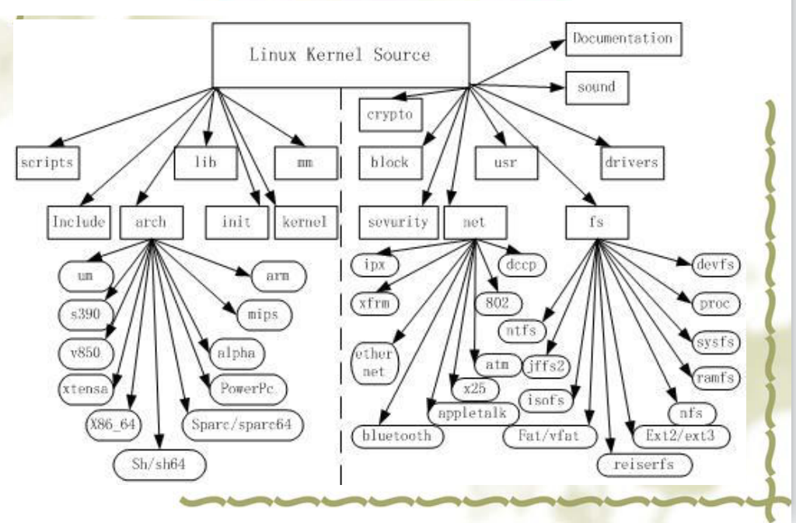

##### 2.Linux内核模块编程入门
- 任何模块都要包含三个头文件：<linux/module.h>、<linux/kernel.h>、<linux/init.h>
- <linux/module.h>:包含了对模块版本控制
- <linux/kernel.h>:包含了常用的内核函数
- <linux/init.h>:包含了_init和_exit，宏_init告诉编译程序相关的函数和变量仅用于初始化，编译程序将标有_init的所有代码存储到特殊的内存段中，初始化结束就释放这段内存
- 入口函数：module_init()
- 出口函数：module_cleanup()

##### 3.相关命令
- 插入模块：insmod modele_example.ko
- 删除模块：rmmod modele_example.ko
- 查看模块信息：dmesg 
- 调试：kdbug、kdb、kgdb

#### 三、内核源码入门

##### 1.链表的演化
- 如果减少一个指针域，就退化成单链表
- 如果只能对链表的首尾进行插入或删除操作，就演变为队结
构
- 如果只能对链表的头进行插入或删除操作，就退化为栈结构
- 如果前驱和后继表示左右孩子，则演变为一颗二叉树

#### 2.Linux内核中链表的定义和使用

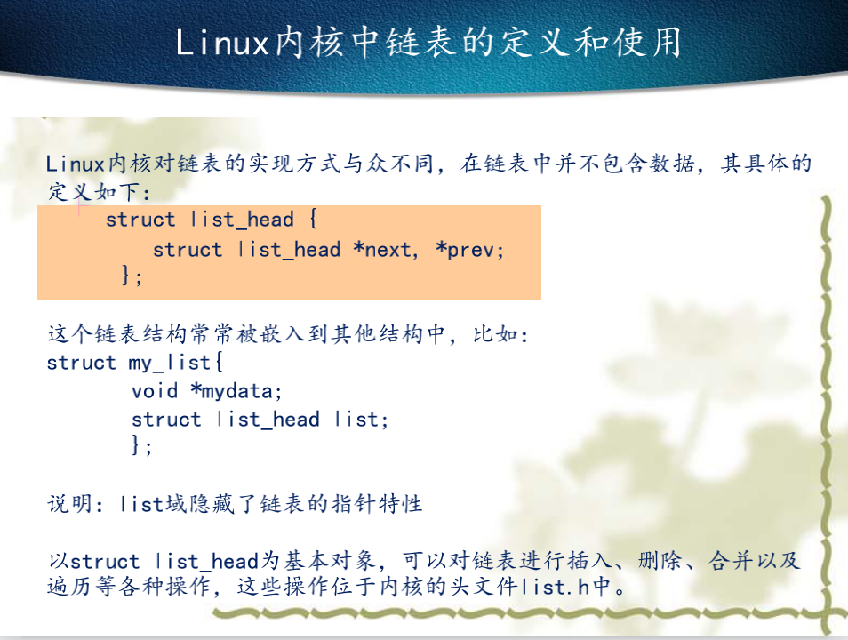

### 第二章 内存寻址

#### 一、内存寻址概述

##### 1.图灵机和冯.诺依曼体系结构
- 冯诺依曼结构——IntelX86，AMD
- 哈佛结构——ARM

##### 2.X86内存寻址的不同时期

- 8位：没有段的概念，访问内存都要通过绝对地址，因此程序中的地址必须进行硬编码、（也就是给出具体地址），而且也难以重定位。
- 16位：“段”的引入，段描述了一块有限的内存区域，区域的起始位置存在专门的寄存器（也就是段寄存器中）。
- 24位：286地址总线位数增加到了24位；从此开始引进了一个全新理念—保护模式；访问内存时不能直接从段寄存器中获得段的起始地址了，而需要经过额外转换和检查 。
- 32位或64位：386是一个32位的CPU，其寻址能力达到4GB，把80386以后的处理器统称为x86

##### 3.为什么引入保护模式？

> 从物理上来看，应该是保护存储器，从逻辑上来看，保护的是操作系统。正式因为实模式的分段机制可以让内存被随意修改，操作系统得不到保护，所以出现了保护模式。

#### 二、保护模式之段机制

##### 1.程序的编译过程
编译（GCC）->汇编（GAS）->链接（ld）->装载并执行

##### 2.保护模式下的寻址

- CPU把虚地址送给MMU
- MMU把物理地址送给存储器

##### 3.MMU的地址转换

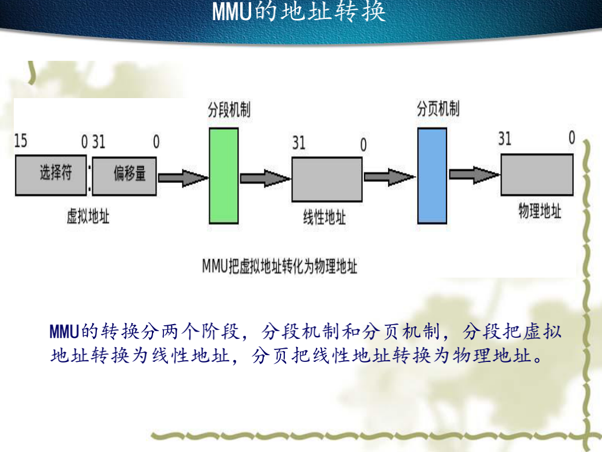

##### 4.段描述符表——段表
- 组成：段号、基地址、界限、属性
- 段号描述虚拟地址空间段的编号
- 基地址是线性地址空间段的起始地址
- 段描述符表中的每一个表项叫做段描述符

##### 5.保护模式下段寄存器中存放什么
- 存放索引或叫段号，因此，这里的段寄存器也叫选择符，即从描述符表中选择某个段。
- RPL表示请求者的特权级（Requestor Privilege Level） 
- TI（Table Index）

##### 6.保护模式下的特权级
- 保护模式提供了四个特权级，用0~3四个数字表示
- 很多操作系统（包括Linux,Windwos）只使用了其中的最低和最高两个，即0表示最高特权级，对应内核态；3表示最低特权级，对应用户态。
- 保护模式规定，高特权级可以访问低特权级，而低特权级不能随便访问高特权级。

##### 7.保护模式下的描述符
- 全局描述符表GDT（Gloabal Descriptor Table） 
- 中断描述符表IDT（Interrupt Descriptor Table） 
- 局部描述符表LDT（Local Descriptor Table）

#### 三、分页机制

##### 1.分页机制中的页

- 所谓分页，就是将虚拟地址空间或线性地址空间划分成若干大小相等的片，称为页（Page） 
- 对物理地址空间分成与页大小相等的存储块，称为块或页面（Page Frame）
- IA-32页的大小: 4KB, 2MB 和4MB
- IA-64页的大小: 4KB, 8KB, 64KB, 256KB, 1MB, 4MB, 16MB 和256MB.

##### 2.分页原理是什么
- 使得每个进程可以拥有自己独立的虚拟内存空间。为了达到这个目的，CPU在访存的时候就需要进行一次地址变换，也就是把虚地址转换为物理地址，于是我们给出映射函数： Pa=f(va)，这种转换在时间和空间上都要付出代价，因此必须进行优化。
- 时间的优化。因为访存很频繁，因此，映射函数f一定要简单，否则会效率很低，所以需要简单查表算法，这也就是页表引入的原因。 
- 空间的优化。因为内存空间是按字节编址的，地址一一进行映射的话，效率也很低，于是要按照一定的粒度（也就是页）进行映射，这样，粒度内的相对地址（也就是页内偏移量）在映射时保持不变。

##### 3.页表
- 页表是一种映射机制，存放的是虚拟地址空间与物理空间地址空间的映射关系
- 页号对应块号

##### 4.单级页表结构
- 在32位的地址空间，通常页的大小为4KB
- 每页起始地址的低12位表示页的属性
- 每页的高20位表示页的起始地址

##### 5.两级页表
- 如果只用以及页表，因为每个页表最大可占4MB的空间，而且必须是连续的，这就为内存的分配带来困难
- 采用分而治之的原则，将高20位分为两部分，分别占十位，形成两级页表

##### 6.地址转换过程
- 第一步，用最高10位作为页目录项的索引，将它乘以4，与CR3中的页目录的起始地址相加，获得相应目录项在内存的地址。
- 第二步，从这个地址开始读取32位页目录项，取出其高20位，再给低12位补0，形成页表在内存的起始地址。
- 第三步，用中间的10位作为页表中页表项的索引，将它乘以4，与页表的起始地址相加，获得相应页表项在内存的地址。
- 第四步，从这个地址开始读取32位页表项，取出其高20位，再将线性地址的第11~0位放在低12位，形成最终32位页面物理地址。

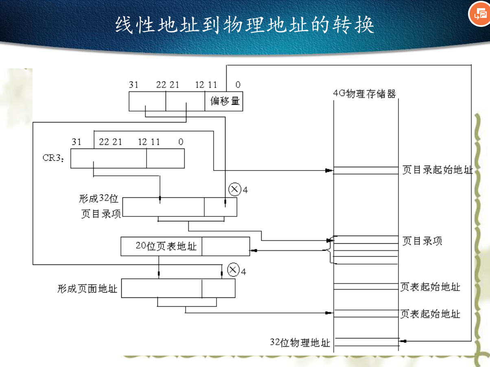

##### 7.页面高速缓存
- 页表放在内存中，这使得CPU在每次存取一个数据时，都要至少两次访问，从而大大降低了访问的速度
- 引入TLB，在访问某个地址空间时，先访问高速缓存区，如果未命中，再访问内存

#### 8.Linux中的分页
- Linux主要采用分页机制来实现虚拟存储器管理
- 页总目录PGD（Page Global Directory） 
- 页上级目录PUD（Page Upper Directory） 
- 页中间目录PMD（Page Middle Derectory） 
- 页表PT（Page table）

### 三、进程管理

#### 一、进程概述

##### 1.进程家族
- 进程是一个动态的实体，它具有生命周期
- 在Linux中，通过调用fork系统调用来创建一个新的进程
- Linux系统启动以后形成了一棵树
- swaspper init_task -> init -> login -> bash -> insmod

##### 2.进程控制块－信息分类

- 状态信息－描述进程动态的变化。
- 链接信息－描述进程的父／子关系。
- 各种标识符－用简单数字对进程进行标识。
- 进程间通信信息－描述多个进程在同一任务上协作工作。
- 时间和定时器信息－描述进程在生存周期内使用CPU时间的统计、计费等信息。
- 调度信息－描述进程优先级、调度策略等信息。
- 文件系统信息－对进程使用文件情况进行记录。
- 虚拟内存信息－描述每个进程拥有的地址空间。
- 处理器环境信息－描述进程的执行环境(处理器的寄存器及堆栈等)

##### 3.进程控制块——Linux进程状态及转换

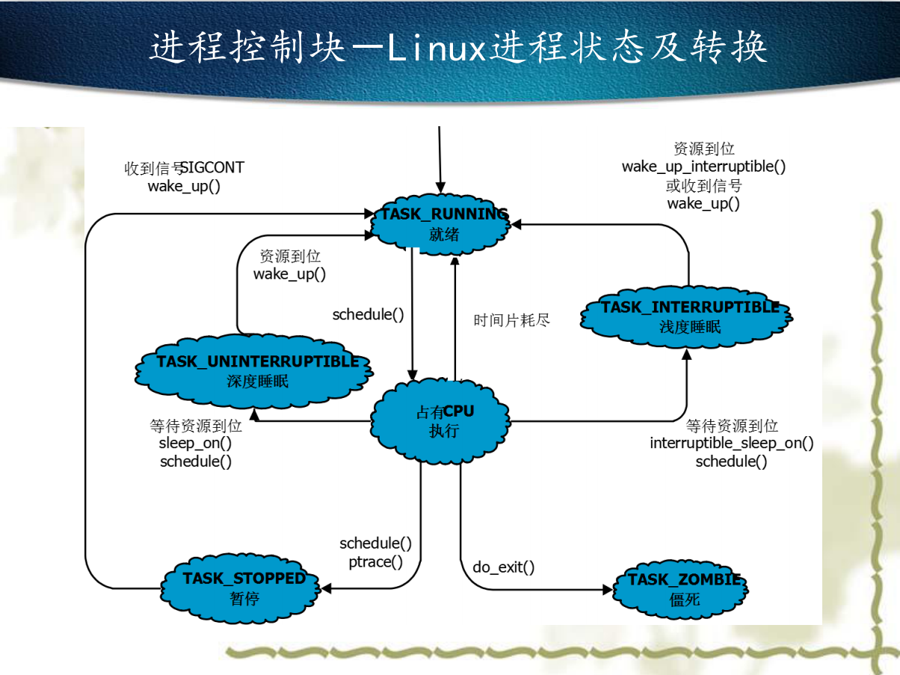

##### 4.进程控制快——如何存放

- 进程的PCB所占的内存是由内核动态分配的，更确切地说，内核根本不给PCB分配内存，而仅仅给内核栈分配8K的内存，并把其中的一部分让给PCB使用。
- 随着Linux版本的变化，进程控制块的内容越来越多，因此把部分进程控制块的内容移出这个空间，只保留访问频繁的thread_info。

##### 5.从进程到容器
- 对于进程来说，它的静态表现就是程序，平常都安安静静地待在磁盘上；而一旦运行起来，它就变成了计算机里的数据和状态的总和，这就是它的动态表现。
- 容器技术的核心功能，就是通过约束和修改进程的动态表现，从而为其创造出一个“边界”。

#### 二、进程的调度

##### 1.进程和线程

- 进程是系统资源分配的基本单位，线程是独立运行的基本单位。
- 进程和线程几乎共享所有的资源，包括代码，数据，进程空间，打开的文件等
- 线程只拥有自己的寄存器和栈。

##### 2.进程的API实现

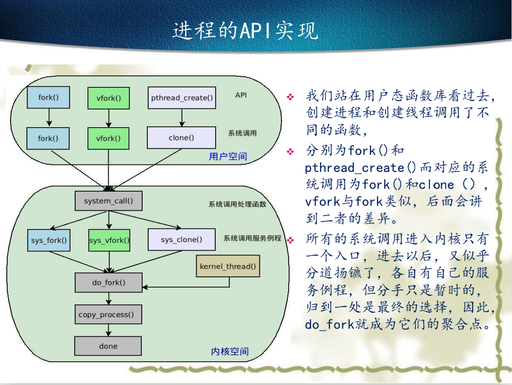

##### 3.fork的实现

- fork调用的do_fork，除了SIGCHLD参数外，有三个参数就是空手而来，有两个参数似乎也没有明确的目标。
- 作为子进程，它完全有自己的个性的，根本不想共享父进程的任何资源，而是让父亲把他所有资源给自己复制一份
- 老爸没有那么傻，而是假装复制了一下，也就是用一个指针指过去而已
- 要写一个页面时，写时复制技术就登场了

##### 4.vfork的实现

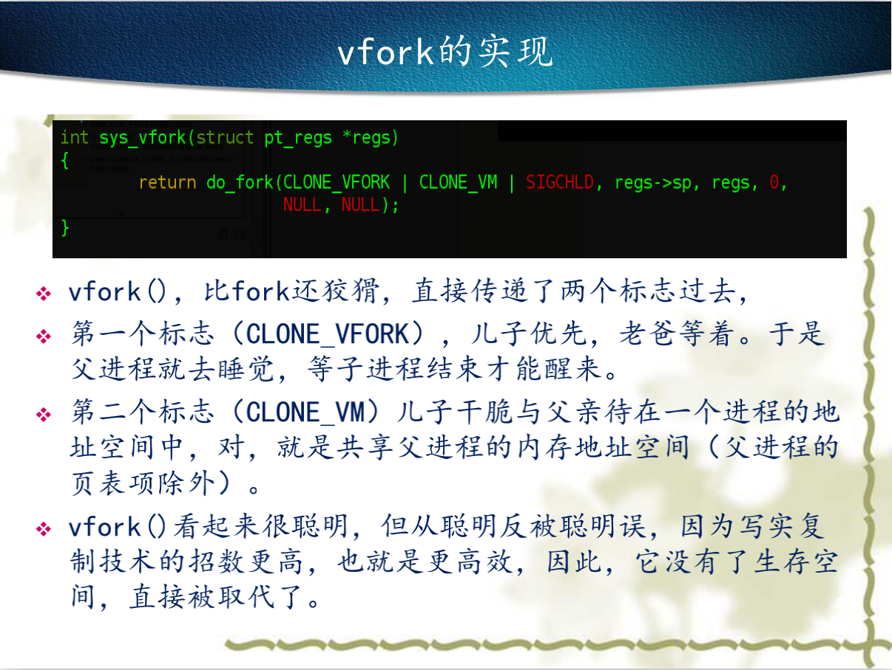

##### 5.clone的实现

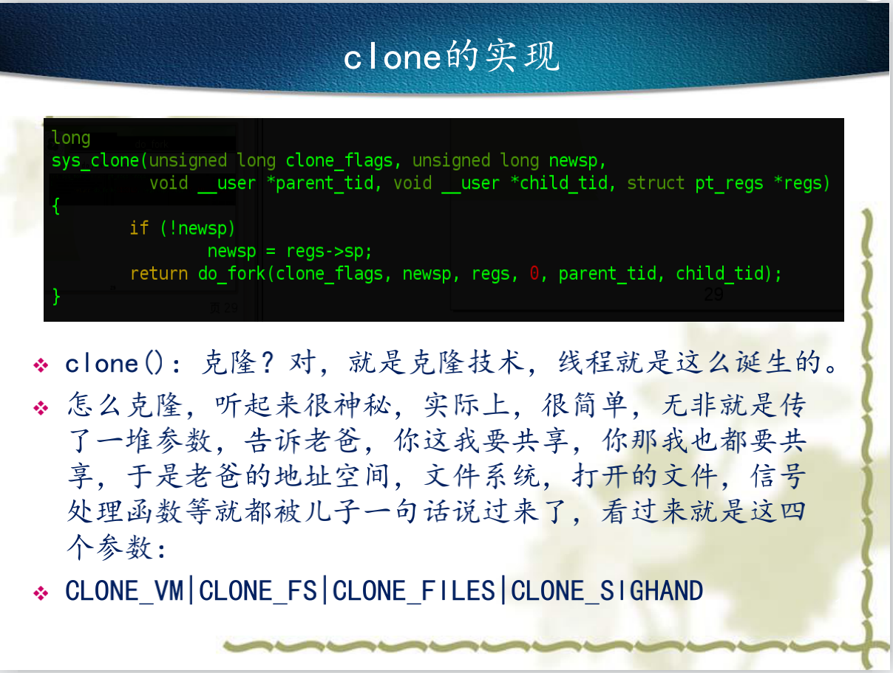

##### 6.内核线程的创建
- 早期内核中创建内核线程是通过kernel_thread()而创建的
- 目前内核中调用 kthread_create()创建的，其本质也是向do_fork()提供特定的flags标志而创建的。

##### 7.copy_process()代码流程图

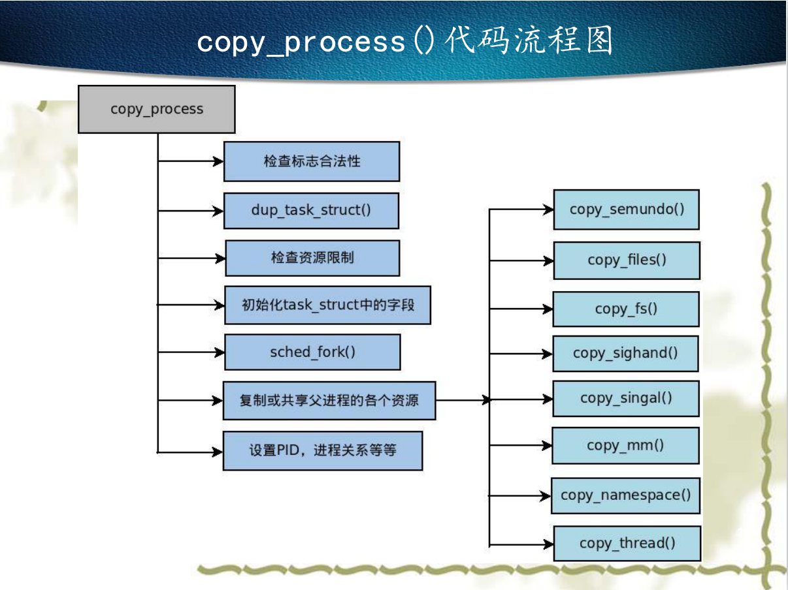

#### 三、进程调度

##### 1.调度模型
- 调度就是总就绪队列中选择一个进程投入CPU运行
- 调度的主战场是就绪队列，核心是调度算法，实质性的动作是进程切换，对于以时间片调度为主的调度，时钟中断是驱动力，确保每个进程在CPU上运行一定的时间

##### 2.进程调度-进程的优先级
用户空间
- 普通优先级（nice ）：从-20～19，数字越小，优先级越高，通过修改这个值可以改变普通进程获取cpu资源的比例。
- 调度优先级（scheduling priority）。从1（最低）~99（最高），这是实时进程的优先级。当然，普通进程也有调度优先级（scheduling priority），被设定为0。

内核空间

- 动态优先级（prio）
- 静态优先级（static_prio）
- 归一化优先级（normal_prio）
- 实时优先级（rt_priorit）

##### 3.进程调度-O(1)调度
- 基本优化思路就是把原来就绪队列上的单链表变成多个链表，即每一个优先级的进程被挂入不同链表中。
- 在O（1）调度器中，实时进程和普通进程被区分开了，普通进程根本不会影响实时进程的调度。
- 把CPU资源分成一个个的时间片，分配给每一个就绪的进程。
- 主调度器（就是schedule函数）的主要功能是从该CPU的就绪队列中找到一个最合适的进程调度执行。

##### 4.完全公平调度-CFS
- CFS调度器的目标是保证每一个进程的完全公平调度。
- CFS调度器和以往的调度器不同之处在于没有时间片的概念，而是分配cpu使用时间的比例。
- CFS为了实现公平，必须惩罚当前正在运行的进程，以使那些正在等待的进程下次被调度。
- CFS通过每个进程的虚拟运行时间（vruntime）来衡量哪个进程最值得被调度。
- CFS中的就绪队列是一棵以虚拟时间为键值的红黑树，虚拟时间越小的进程越靠近整个红黑树的最左端。

### 第四章 内存管理

#### 一、内存管理机制

##### 1.CPU的Cache
- lscpu查看内存的结构层次
- L1d和L1i分别表示一级数据很指令Cache

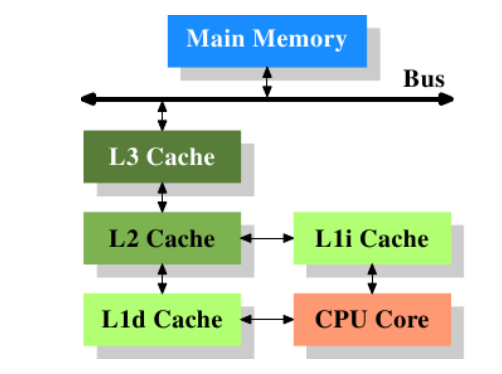

##### 2.虚拟内存实现机制
- 地址映射机制
- 内存分配机制
- 缓存和刷新机制
- 交换机制
- 请页机制

##### 3.虚拟内存实现机制关系图
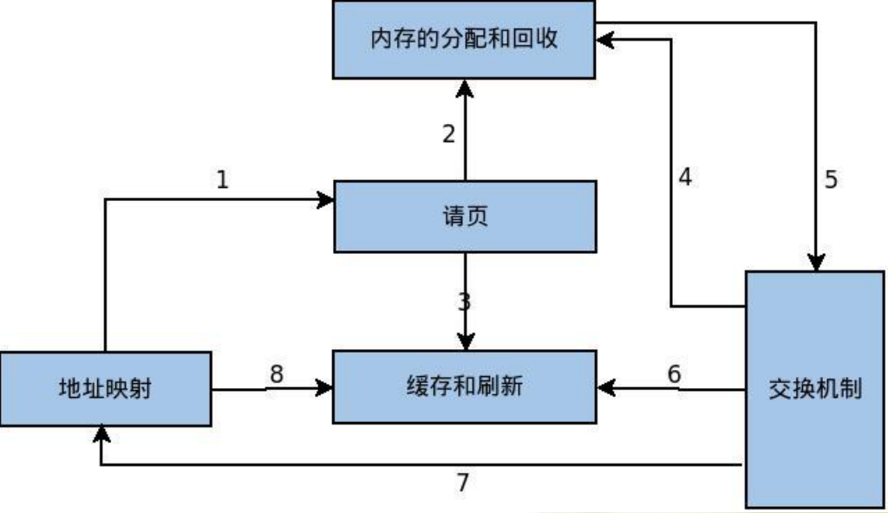
> 首先内核通过映射机制把进程从磁盘映射到虚拟地址空间，当进程执行时，如果发现要访问的页没有在物理
内存时，就发出了页请求如图①；如果有空闲的内存可
供分配，就请求分配内存如图②（于是用到了内存的分
配和回收机制），并把正在使用的页记录在页缓存中如 图③（于是就使用了缓存机制）。如果没有足够的内存
可供分配，那么就调用交换机制，腾出一部分内存如图
④⑤。另外在地址映射中要通过TLB来加速物理页的寻找
如图⑧；交换机制中也要用到交换缓存如图⑥，并且把
物理页内容交换到交换文件中后也要通过修改页表来映
射文件地址如图⑦。

##### 4.进程虚拟地址空间

- 每个进程通过系统调用进入内核，Linux内核空间由系统内的所有进程共享
- 每个进程拥有4G的虚拟地址空间，每个进程有各自的私有用户空间
- 进程地址空间：kernel space -> Stack -> Memory Mapping Region -> Heap -> Bss  -> Data -> Text

##### 5.用数据结构描述进程的用户空间
- mm_struct结构对金成整个用户空间进行描述
- vm_area_structs结构对用户空间中各个内存区进行描述

##### 6.mm_struct如何描述地址空间

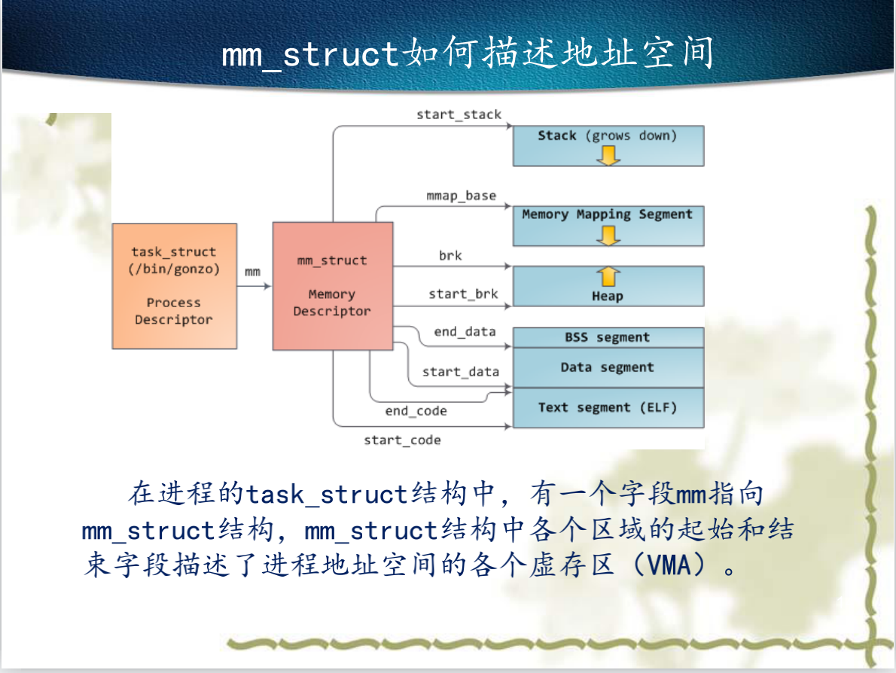

#### 二、用户空间的创建

##### 1.创建进程用户空间
- 当fork()系统调用在创建新进程时也为该进程创建完整的用户空间
- 通过拷贝或共享父进程的用户空间来实现的，即内核调用copy_mm()函数，为新进程建立所有页表和mm_struct结构（通常，每个进程都有自己的用户空间，但是调用clone()函数创建的内核线程时共享父进程的用户空间）

##### 2.虚存映射

- 当调用exec()系统调用开始执行一个进程时，进程的可执行映像（包括代码段、数据段，堆和栈等）必须装入到进程的用户地址空间。
- 如果该进程用到了任何一个共享库，则共享库也必须装入到进程的用户空间。
- Linux并不将映像装入到物理内存，相反，可执行文件只是被映射到进程的用户空间中。这种将可以执行文件映像映射到进程用户空间的方法被称为“虚存映射”。
- 分类：共享的、私有的、匿名的

##### 3.VMA的创建方式
- 在用户空间通过mmap()系统调用获取do_mmap()的功能
- 在内核空间，可以直接调用do_mmap()创建一个新的虚拟内存

##### 4.请页机制
- 进程运行时，CPU访问的是用户空间的虚地址。
- Linux仅把当前要使用的少量页面装入内存，需要时再通过请页机制将特定的页面调入内存。
- 当要访问的页不在内存时，产生一个页故障并报告故障原因。

##### 5.缺页异常处理

#### 三、内存分配与回收机制

##### 1.程序的装载过程
- 程序在装载时，并没有把指令和数据加载进物理内存，知识通过ELF文件头部信息建立起可执行文件与虚拟地址空间的映射关系而已
- 真正的加载过程发生在缺页异常处理时
- 内核根据建立的映射关系，在可执行文件中找到所需的内容
- 分配一个物理内存页面，并将可执行文件内容加载到改内存中
- 建立该物理内存和虚拟地址空间的映射关系，即填充页表，然后把控制权移交给进程

##### 2.内核空间的划分
- 0M到high_memory的物理内存称为地段内存，大于high_memory的物理内存称为高端内存
- 高端内存映射到内核空间的方式：永久映射、固定映射、vmalloc机制

##### 3.物理内存管理机制
- 伙伴算法：负责大块连续物理内存的分配和释放，以页框为基本单位。可以避免外部碎片
- per-CPU页框高速缓存：内核经常请求和释放单个页框，该缓存包含预先分配的页框，用于满足本地CPU发出的单一页框请求
- slab缓存：负责小块内存的分配，并且它也作为高速缓存，主要针对内核中经常分配并释放的对象
- vmalloc机制：vmalloc机制使得内核通过连续的线性地址来访问非连续的物理页框，这样可以最大限度的使用高端物理内存。

##### 4.Slab分配机制
- slab通用缓存：通用缓存针对一般情况，使用分配任意大小的物理内存，其接口为kmalloc()
- slab专用缓存：专用缓存是对特定的对象，比如为进程控制块创建高速缓存task_struct_cachep

##### 5.vmalloc和kmalloc之间的区别
- vmalloc分配的物理地址无需连续，分配在VMALLOC_START~VMALLOC_END之间
- kmacloc确保页在物理上是连续的，分配的内存处于3GB~high_memory之间，这段内核空间与物理空间一一对应

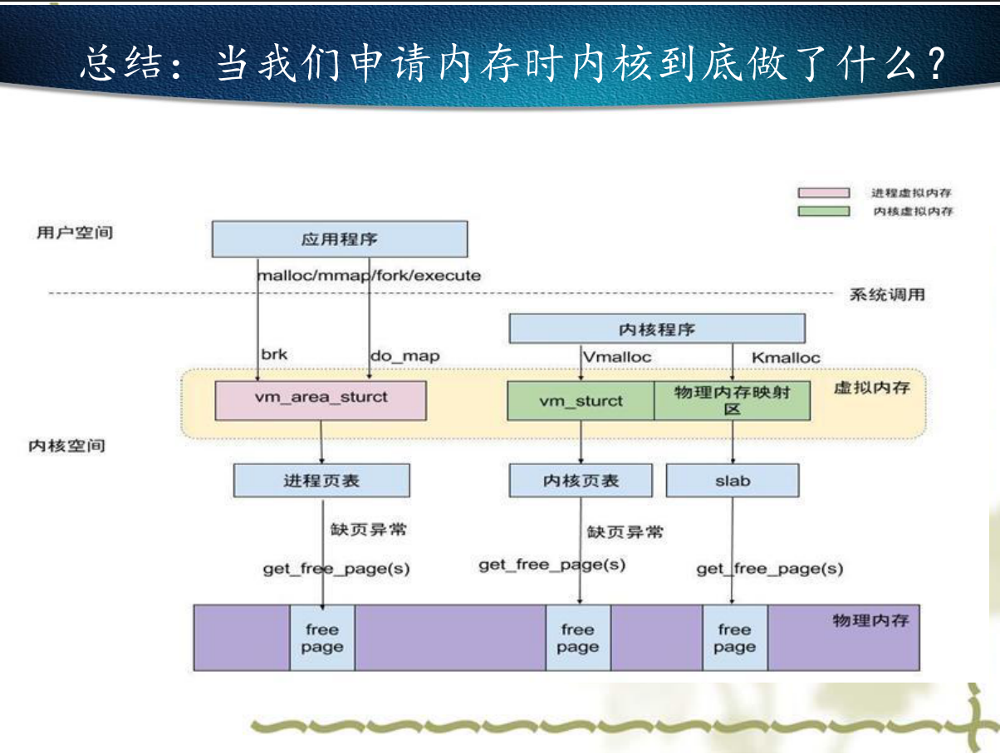

##### 6.伙伴算法概述

- 大小相同、物理地址连续的两个页块被称为伙伴。
- Linux的伙伴算法把所有的空闲页面分为多个块链表（该默认大小为11）个，每个链表中的一个块含有2的幂次个页面，即页块或简称块。
- 伙伴算法的分配原理是，如果分配阶为n的页框块，那么先从第n条页框块链表中查找是否存在这么大小的空闲页块。如果有则分配，否则在第n+1条链表中继续查找，直到找到为止。

##### 7.物理内存分配器
> 基于伙伴算法、每CPU高速缓存和slab高速缓存形成两种
内存分配器。

- 第一种是分区页框分配器（zoned page frame allocator），处理对连续页框的内存分配请求。
- 第二种是slab分配器，它将各种分配对象分组放进高速缓存，即每个高速缓存都对同类型分配对象的一种“储备”。

##### 8.从用户态到内核态的内存分配
- 首先进入内核，建立虚拟地址空间的映射，获得一块虚拟内存区VMA。
- 当进程对这块虚存区进行访问时，如果物理内存尚未分配，那么此时发生一个缺页异常，通过get_free_pages 申请一个或多个物理页面
- 再将此物理内存和虚拟内存的映射关系写入页表。

### 第五章 中断

#### 一、中断概述

##### 1.中断简介
- 中断是CPU对系统发生的某个事件做出的一种反应
- 引入中断，是为了支持CPU和设备之间的并行操作
- CPU接收到中断信号，并不会立即响应，而是在执行每条指令周期的最后一个时钟周期，一旦检测到中断信号有效，cpu才在当前指令执行完后转入中断响应周期

##### 2.高级可编程中断控制器（APIC）
- 每个x86的核有一个本地APIC，这些本地APIC通过中断控制器通信总线连接到IO APIC上
- IO APIC手机各个外设的中断，并翻译成总线上的信息，传递给某个CPU上的本地APIC

##### 3.中断子系统分成4个部分
- 硬件无关的代码，称之为Linux内核通用中断处理模块
- CPU体系结构相关的中断处理。
- 中断控制器的驱动代码，和系统使用的中断控制器相关
- 普通外设的驱动。这些驱动使用Linux内核通用中断处理模块的API来实现自己的驱动逻辑

##### 4.中断向量——中断源

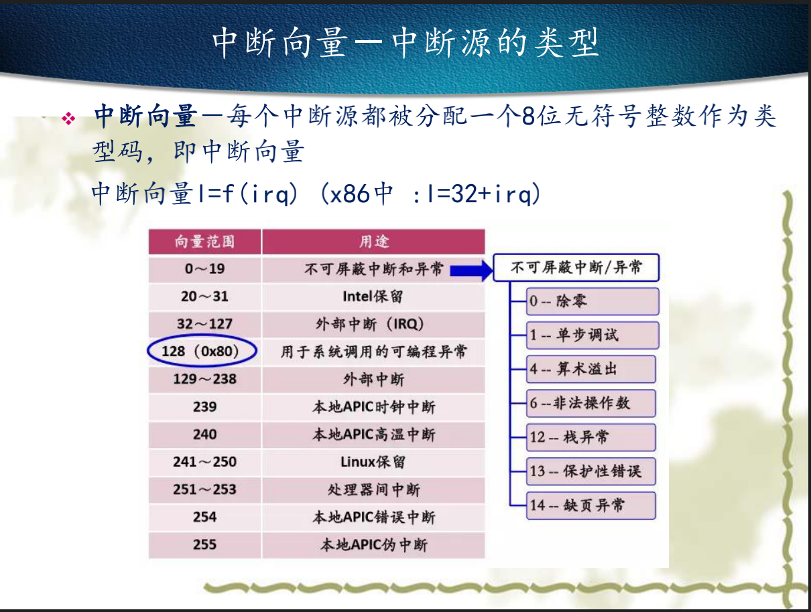

##### 5.中断描述符表中门

> “门”的含义是当中断发生时必须先通过这些门，然后才
能进入相应的处理程序。

- 中断门：用户态的进程不能访问Intel的中断门。所有的中断处理程序
都由中断门激活，并全部限制在内核态。
- 陷阱门：控制权通过陷阱门进入处理程序时维持中断标志位（IF）不变，也就是说，不关中断。
- 系统门：这是Linux内核特别设置的，用来让用户态的进程访问Intel的陷阱门，因此，门描述符的DPL为3。系统调用就是通过系统门进入内核的。

#### 一、中断处理机制

##### 1.初始化中断描述符
- Linux内核在系统的初始化阶段要初始化可编程控制器
- 将中断描述符表的起始地址装入中段描述符表寄存器，并初始化表中的每一项，当计算机运行在实模式时，中断秒适度表被初始化，并由BIOS使用
- 真正进入了Linux内核，中断描述符就被移到内存的另一个区域，并为进入保护模式进行初始化

##### 2.中断门的设置
- 中断门的设置是由init_IRQ()函数中的一段代码完成的
- 设置时必须跳过用于系统调用的向量0x80 
- 中断处理程序的入口地址是一个数组interrupt[]，数组中的每个元素是指向中断处理例程（ISR）的指针。 
-  每个中断处理例程属于内核中的代码段，其段基地址存放于全局描述表（GDT）中

##### 3.中断处理过程
- 中断和异常的硬件处理
- 中断请求队列的建立
- 中断处理程序的执行
- 从中断返回

##### 4.X86的中断处理

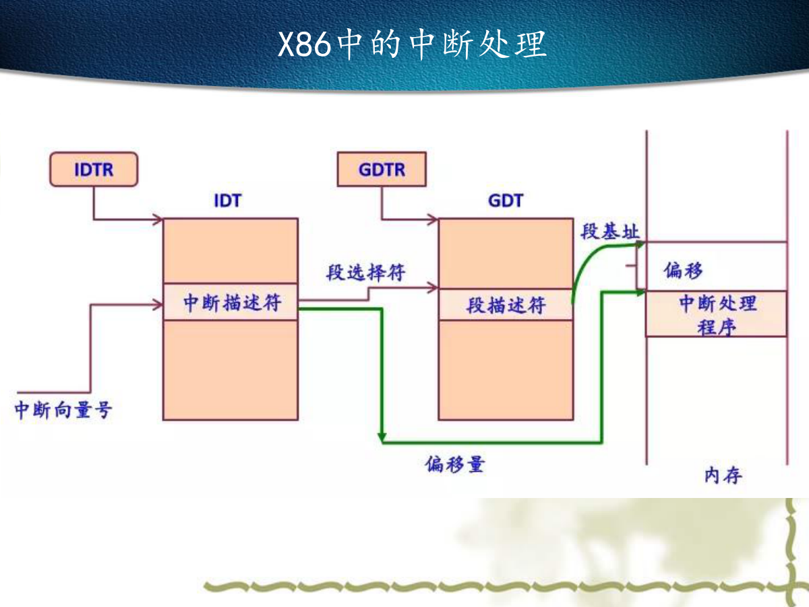

##### 5.中断描述符——IRQ数据结构

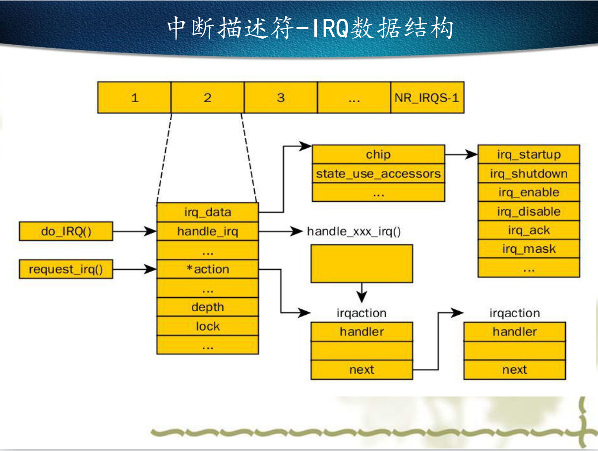

##### 6.从中断/异常/系统调用返回

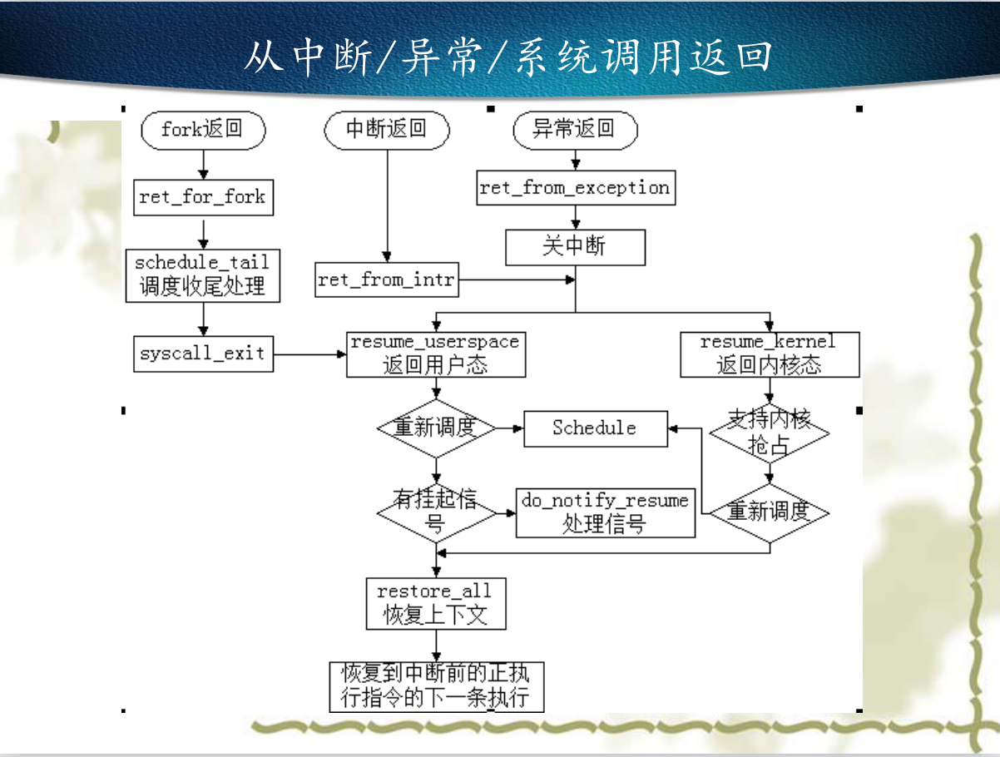

#### 三、中断的下半部

##### 1.中断的下半部
- 随着系统的不断复杂，中断处理函数要做的事情也越来越多，多到都来不及接收新的中断了，于是发生了中断丢失
- 内核把中断处理分为两部分：上半部（top half）不可中断和下半部（bottom half）可中断，上半部（也就是中断服务程序）内核立即执行，而下半部（就是一些内核函数）留着稍后处理

##### 2.软中断机制
- 中断的上半部、下半部是一种概念，实际上是内核中的一个函数，这些函数写好后，什么时候执行，如何执行，必须由内核管理
- 中断注册函数request_irq()把中断服务历程添加到中断请求队列中
- 执行由do_IRQ完成

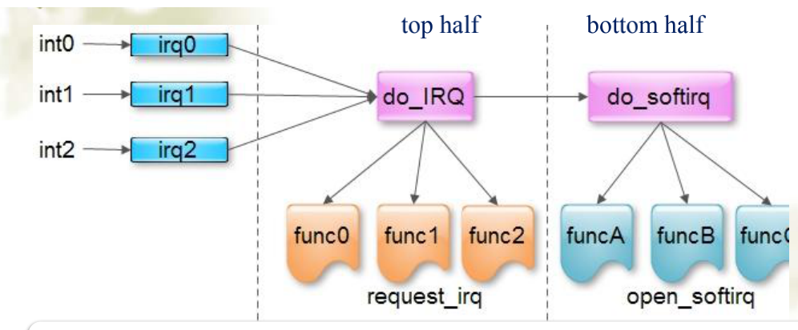

##### 3.软中断类型

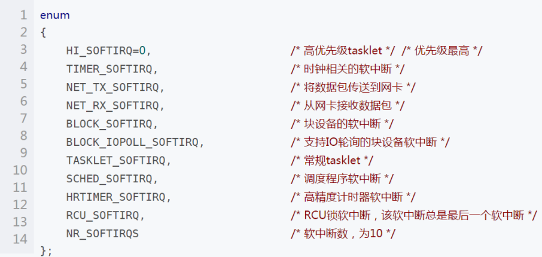

##### 4.何时使用哪种中断机制

- 软中断的使用原则很简单，最好不用。它甚至都不算是一种真正的中断处理机制，只是tasklet的实现基础。
- 工作队列也要少用，如果不是必须要用到线程才能用的某些机制，就不要使用工作队列
- 对于中断来说，只是对中断进行简单的处理，大部分工作是在驱动程序中完成的
- 除了上述情况，一般都使用小任务tasklet。

#### 三、Linux的时间系统

##### 1.时钟中断的作用

- 维持系统时间
- 促进进程的转换
- 保证所有进程共享CPU
- 利用时钟中断进行记账、系统监督工作以及确定未来的调度优先级等工作

##### 2.基本时钟硬件
- 编程定时/计数器产生脉冲，由此引发中断请求信号
- 从本质上说，时钟中断知识一个周期性地信号，完全是硬件行为

##### 3.与时钟有关的硬件

- 实时时钟RTC
- 可编程间隔器PIT
- 时间戳计数器
- 高精度计时器
- CPU本地定时器
- 高精度定时器

##### 4.基本时钟运行机制

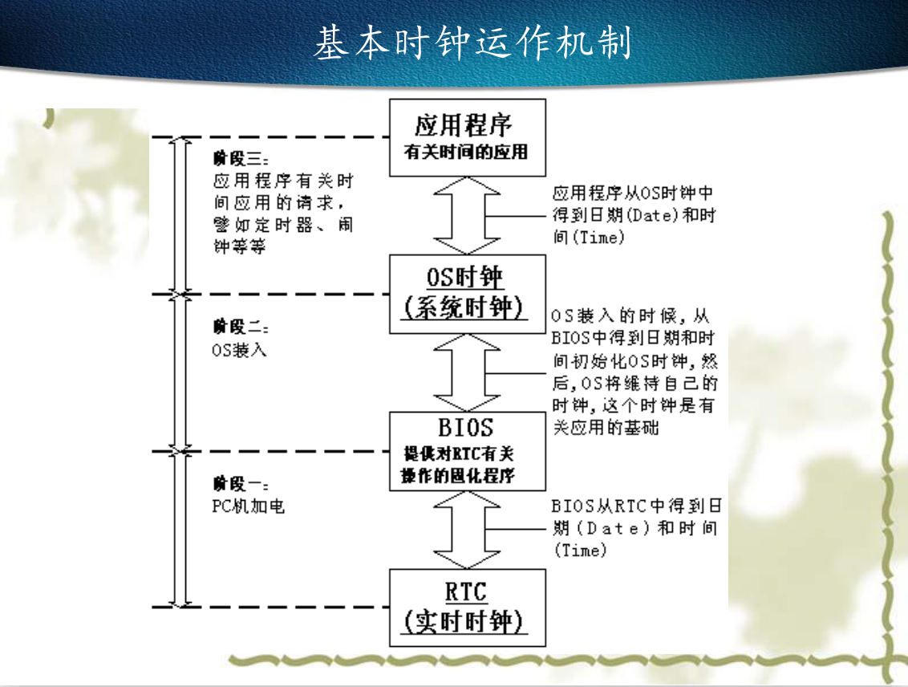

##### 5.Linux时钟框架

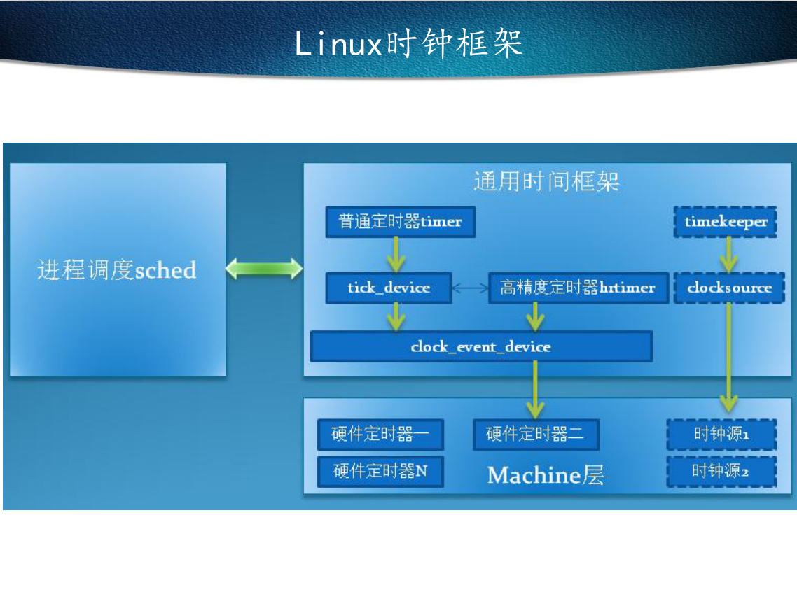

- 在软件架构上看，时钟事件设备（clock_event_device）被分为了两层，与硬件相关的被放在了machine层，而与硬件无关的通用代码则被集中到了通用时间框架层
- tick_device起什么作用？它是基于时钟事件设备的进一步封装，用于代替原有的时钟滴答中断，给内核提供节拍事件，以完成进程的调度和进程信息统计，负载平衡和时间更新等操作。
- 高分辨率定时器的代码实现时，内核的开发者考察了多种数据结构，例如基数树、哈希表等等，最终选择了红黑树（rbtree）来组织hrtimer。hrtimer不停地被创建和销毁，新的hrtimer按顺序被插入到红黑树中，树的最左边的节点就是最快到期的定时器。

##### 6.定时器的使用

- 定义定时器
- struct timer_list my_timer; 
- 初始化定时器，填充定时器的结构
- init_timer(&my_timer); 
- 激活定时器：add_timer(&my_timer);
- 如果需要修改修改定时器，则调用 mod_timer(&my_timer) 
-  如果需要在定时器到期前停止定时器，可以使用
- del_timer(&my_timer)函数：

### 第六章 系统调用

#### 一、Linux中各种接口

##### 1. Linux API
- Linux内核的系统调用接口和GNU C库（glibc）中的例程。
- Linux内核系统调用接口系统调用接口是内核中所有已实现和可用系统调用的集合
- GNU C标准库是Linux内核系统调用接口的封装

##### 2.POSIX标准

- POSIX表示可移植操作系统接口（Portable Operating System Interface of UNIX，缩写为 POSIX ）
- POSIX标准定义了操作系统应该为程序提供的标准接口

##### 3.Linux ABI内容

- 一个特定的处理器指令集
- 函数调用惯例
- 系统调用方式 
- 可执行文件的格式(ELF,PE)

#### 二、系统调用机制

##### 1.跟踪进程所调用的系统调用

> strace ls

##### 2.中断、异常和系统调用比较
- 中断：外设发出的请求
- 异常：应用程序意想不到的行为
- 系统调用：应用程序请求OS提供服务 
- 响应方式
> 中断是异步的，异常是同步的，而系统调用既可以是异步，也可以是同步。
- 处理机制
>中断服务程序在内核态下运行，对用户是透明的。异常出现时，或者杀死进程，或者重新执行引起异常的指令。系统调用，用户发出请求后等待OS的服务。

##### 3.系统调用的基本概念
- 系统调用标识号：用来唯一标识每个系统调用
- 系统调用表：是用来把系统调用号和相应的服务例程关联起来。该表存放在sys_call_table数组中

### 第七章 内核同步

#### 一、内核同步机制概述

##### 1.并发执行的原因

- 中断
- 睡眠
- 内核抢占
- 对称多处理

##### 2.竞争条件
- 至少有两个可执行上下文“并行执行”
- 可执行上下文对共享内训变量执行“读写”访问

##### 3.临界区
- 访问和操作共享数据的代码段叫做临界区
- 多个内核任务并发访问同一个资源通常是不安全的。为了避免对临界区进行并发访问，编程者必须保证临界区代码被原子地执行。

##### 4.保护临界区的措施
- 使临界区的操作原子进行
- 进入临界区后禁止抢占
- 串行地访问临界区

##### 5.原子操作
> 对于由多个内核任务进行共享的变量，其load-modify-store必须是原子地进行的，不能分割

##### 6.共享队列和加锁
- 当共享资源是一个复杂的数据结构时，竞争状态往往会使该数据结构遭到破坏。
- 访问队列必须加锁

##### 7.死锁的避免
> 所有任务都在相互等待，但它们永远不会释放已经占有的资源，于是任何任务都无法继续，这种情况就是死锁。
- 加锁的顺序是关键。
- 防止发生饥饿
- 不要重复请求同一个锁
- 越复杂的加锁方案越有可能造成死锁

#### 二、内核同步措施

> 内核同步措施主要有中断屏蔽、原子操作、自旋锁、信号量

##### 1.中断屏蔽
- 在进入临界区之前屏蔽系统的中断，从而保证正在执行的内核任务不被中断处理程序锁抢断，防止某些静态条件的发生，在退出临界区后，重新打开中断
- 中断屏蔽的缺点：1.不能解决多处理器引发的竞态；2.在屏蔽器件所有的中断无法得到处理

##### 2.自旋锁
- 设计自旋锁的初衷是在短期间内进行轻量级的锁定，所以自旋锁不应该被持有时间过长。
- 自旋锁在内核中主要用来防止多处理器中并发访问临界区，防止内核抢占造成的竞争
- 自旋锁不允许任务睡眠，持有自旋锁的任务睡眠会造成自死锁，因此自旋锁能够在中断上下文中使用。

##### 3.信号量
- Linux中的信号量是一种睡眠锁
- 若有一个任务试图获得一个已被持有的信号量时，信号量会将其推入等待队列，然后让其睡眠。
- 信号量具有睡眠特性，适用于锁会被长时间持有的情况，只能在进程上下文中使用。

##### 4.信号量与自旋锁的比较

##### 5.内核其他的同步措施

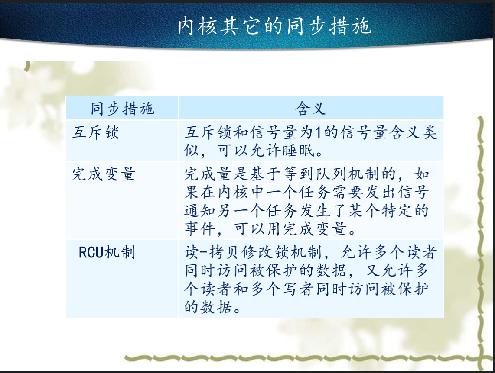

### 第八章 文件系统

#### 一、虚拟文件系统的引入

##### 1.Linux文件系统
- 文件系统是操作系统用于明确存储设备或分区上的文件的方法和数据结构
- 操作系统文件信息的软件机构称为文件管理系统
- Linux常见的文件系统有ext2,3,4,NTFS,JFS,XFS等

##### 2.Linux的文件结构
> Linux采用标准的目录结构---树型结构，无论操作系统管理几个磁盘分区，这样的目录树只有一个。

##### 3.Linux文件系统之索引点
- Linux文件系统使用索引节点来记录文件信息
- 系统给每个索引节点分配一个号码，称为索引节点
- 文件系统就是靠这个索引节点号识别一个文件

##### 4.文件系统类型
- ext2具有极快的速度和极小的CPU占用率，可用于硬盘和移动存储设备
- ext3增加日志功能，可回溯追踪
- ext4日志式文件系统，支持1EB（1024*1024TB），最大单文件16TB，支持连续写入可减少文件碎片。
- xfs可以管理500T的硬盘，
- brtfs文件系统针对固态盘做优化等等

##### 5.文件系统的安装
> 将一个文件系统的顶层目录挂到另一个文件系统的子目录上，使他们成为一个整体，称为“安装（mount）”。把该子目录称为“安装点（mount point）”

##### 6.虚拟文件系统（VFS）框架
> 虚拟文件系统所提供的抽象界面主要由一组标准的、抽象的操作构成，例如open(),read()、write()等，这些函数以系统调用的形式供用户程序调用。

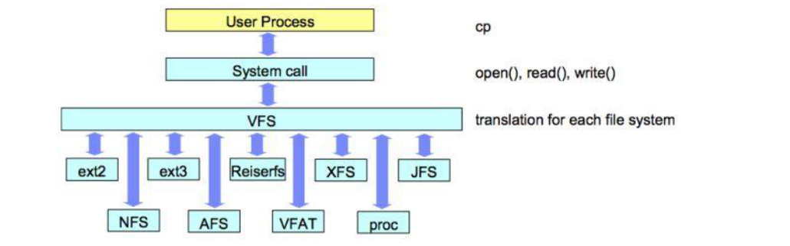

- Linux内核采用VFS框架来组织文件系统，每个文件系统用一个超级块数据结构来描述
- 一个文件系统如果想加入VFS，就得先在VFS进行注册

#### 二、VFS的数据结构

##### 1.VFS共性对象的抽象

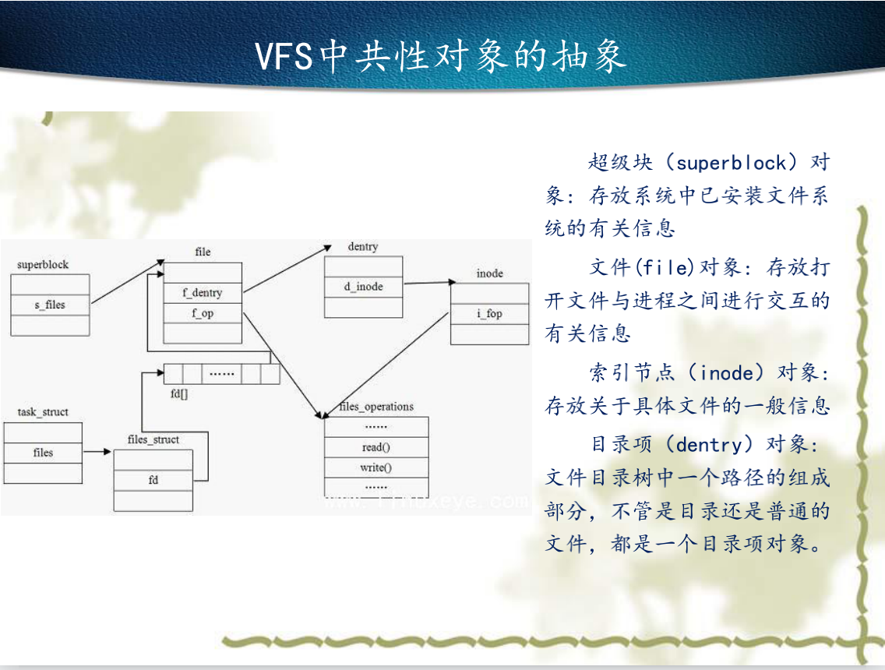

##### 2.索引节点对象-描述文件属性
> 索引节点对象存储了文件的相关信息，代表了存储设备上的一个实际的物理文件。当一个 文件首次被访问时，内核会在内存中组装相应的索引节点对象，以便向内核提供对一个文件进行操 作时所必需的全部信息；这些信息一部分存储在磁盘特定位置，另外一部分是在加载时动态填充的。

##### 3.目录项对象——描述文件的路径

- 引入目录项的概念主要是出于方便查找文件的目的。
- 一个路径的各个组成部分，不管是目录还是普通的文件，都是一个目录项对象。
- 不同于前面的两个对象，目录项对象没有对应的磁盘数据结构，VFS在遍历路径名的过程中现场将它们逐个地解析成目录项对象。

##### 4.文件对象
> 文件对象是已打开的文件在内存中的表示，主要用于建立进程和磁盘上的文件的对应关系。它由sys_open()现场创建，由sys_close()销毁。

##### 5.与进程相关的文件结构
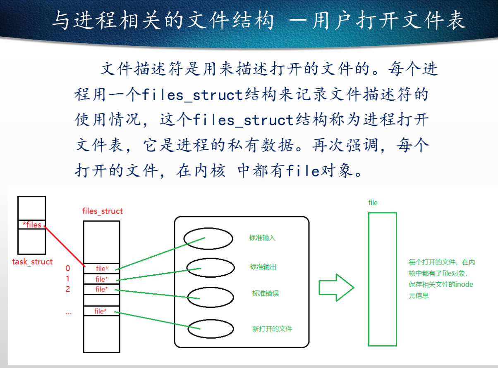

#### 三、文件系统的缓冲区

##### 1.文件系统中的缓冲区
>缓冲区(buffer)，它是内存空间的一部分。也就是说，在内存空间中预留了一定的存储空间，这些存储空间用来缓冲输入或输出的数据，这部分预留的空间就叫做缓冲区。

##### 2.buffer和cache有何不同
> buffer，内存缓冲区，是各进程产生的文件临时存放区，一定时间段内统一写入磁盘，减少磁盘碎片和 硬盘的反复寻道，从而提高系统性能；简单来说，buffer就是存放要写入磁盘的数据。

> cache，内存缓存区，经常被用在磁盘的I/O请求上，如果有文件频繁被访问到，系统会将文件缓存在cache区，供CPU、进程等访问；简单来说cache中的数据就是存放磁盘中读出来的数据。

##### 3.Buffer Cache和 Page Cache有何不同？

#### 四、页高速缓存以及读写

##### 1.文件系统的读写单位
> 文件系统的读写单位是块，一个块的大小是2的n次方个扇区，比如1k，2k, 4k, 4M 等

##### 2.从Buffer Cache到Page Cache

- buffer cache是面向底层块设备的，所以它的粒度是文件系统的块，块设备和系统采用块进行交互。
- 块再转换成磁盘的基本物理结构扇区。
- 内核的内存管理组件采用了比文件系统的块更高级别的抽象-页(page)，页的大小一般从4KB到2MB,粒度更大，处理的性能更高。

##### 3.索引节点、页和页缓存之间的关系

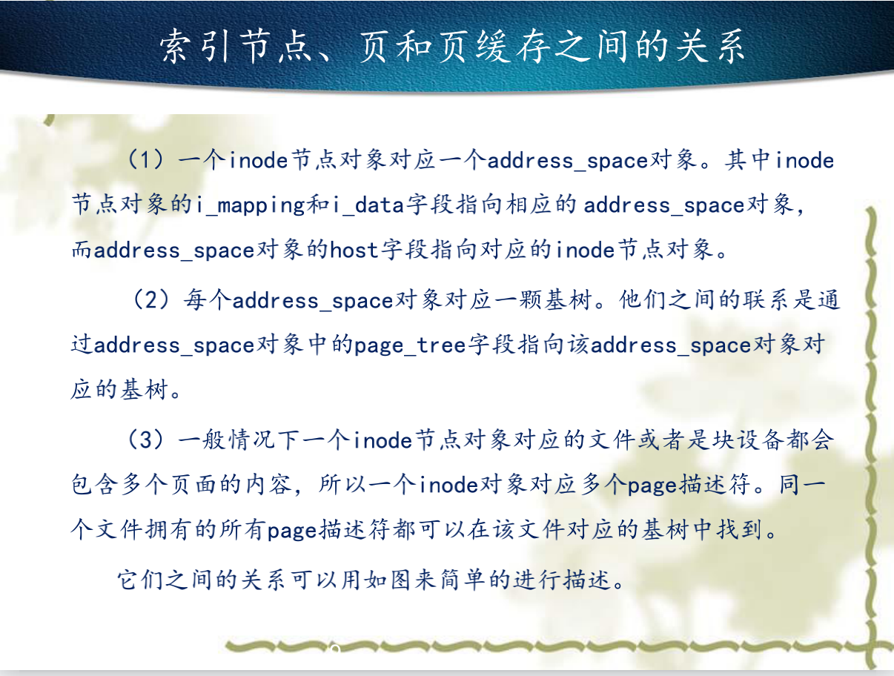

##### 4.如何读取一个文件

##### 5.如何写入文件

### 第九章 设备驱动

#### 一、设备驱动概述

##### 1.如何表示设备
- 索引节点
- 主设备号
- 次设备号

##### 2.设备的分类
- 块设备
- 字符设备
- 网络设备

##### 3.不同设备的类型的差异性
- 字符设备和块设备对应/dev下的一个设备文件。而网络设备不存在这样的设备文件。网络设备使用套接字socket访问，虽然也使用read,write系统调用，但这些调用只作用于软件对象。
- 块设备只响应来自内核的请求，而网络驱动程序异步接收来自外部世界的数据包，并发送到内核。
- 文件系统通常都建立在块设备上，也有很多文件系统放在内存，比如/proc，不需要驱动程序。

##### 4.设备驱动程序在应用开发中的位置

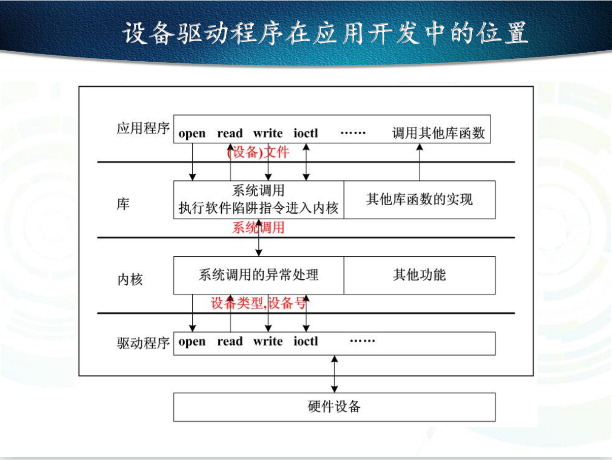

##### 5.内核配置选项及驱动程序编译

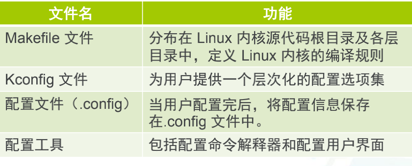

#### 二、IO空间的管理

##### 1.I/O端口
- 设备驱动程序要直接访问外设或其接口卡上的物理电路，通常以寄存器的形式出现访问；
- 外设寄存器也称为I/O端口，通常包括控制寄存器、状态寄存器和数据寄存器三类。

##### 2.I/O资源管理

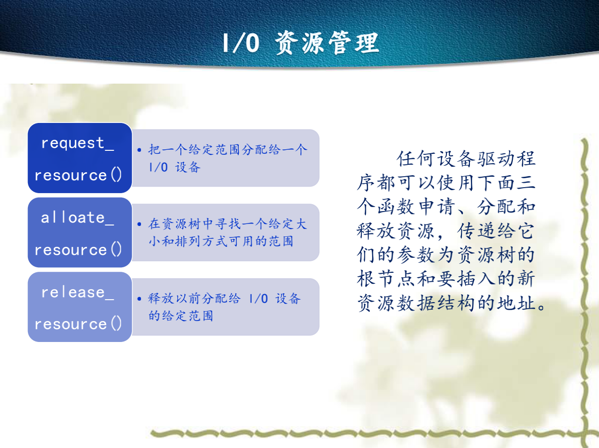

#### 三、设备驱动模型

##### 1.Linux设备驱动模型引入的目的

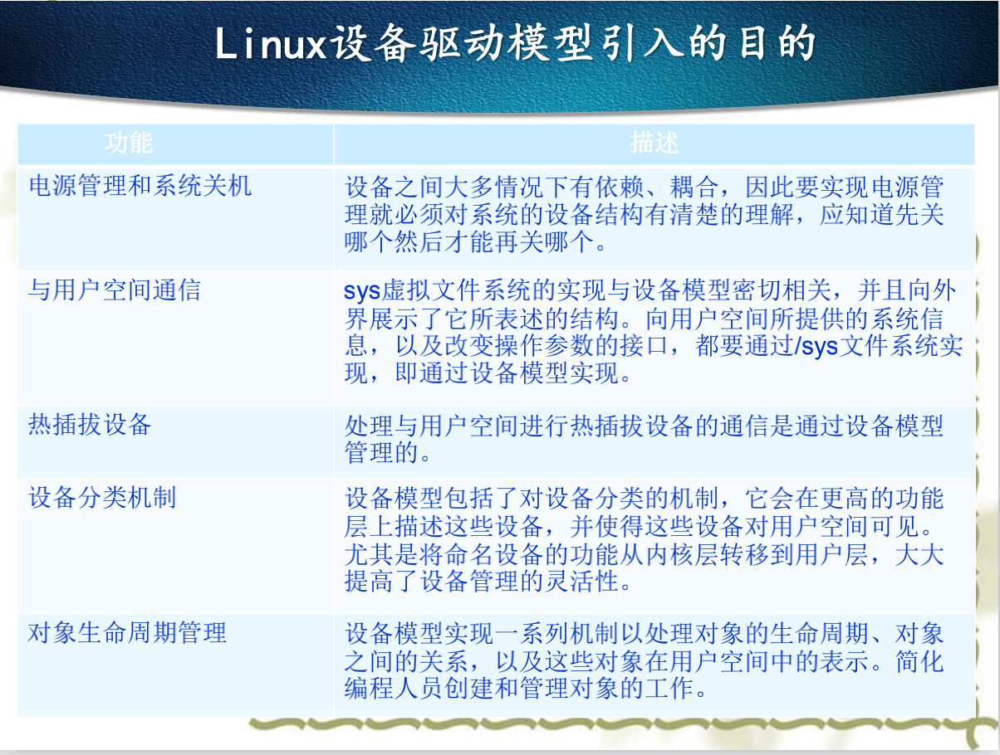

##### 2.核心对象之kobject

- kobject结构体是设备驱动模型底层的一个结构体，这个结构体是设备驱动模型下的所有对象的一个基本单元，它是对设备驱动模型下所有对象抽象出来的共有的部分；
- kobject结构体提供了一些公共型的服务：对象引用计数、维护对象链表、对象上锁、对用户空间的表示。
- 设备驱动模型中的各种对象其内部都会包含一个kobject，地位相当于面向对象思想中的总基类。

#### 三、字符设备驱动程序

##### 1.字符设备基础
- 字符设备是指只能一个字节一个字节进行读写操作的设备，不能随机读取设备中的某一数据，读取数据要按照先后顺序
- 字符设备是面向流的设备，常见的字符设备有鼠标、键盘、串口、控制台和LED等
- 一般每个字符设备或者块设备会在/dev目录下对应一个设备文件

##### 2.编写字符设备驱动的步骤
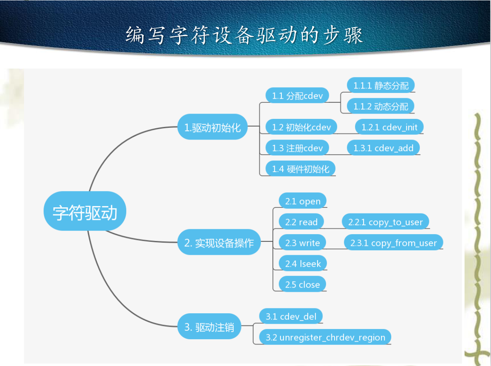

##### 3.设备号的申请和释放

#### 五、块设备驱动程序

##### 1.块设备和字符设备的区别
- 块设备上可以mount文件系统，而字符设备是不可以的；
- 数据经过块设备相比操作字符设备需要多经历一个数据缓冲层（buffer cache）机制。

##### 2.I/O调度算法

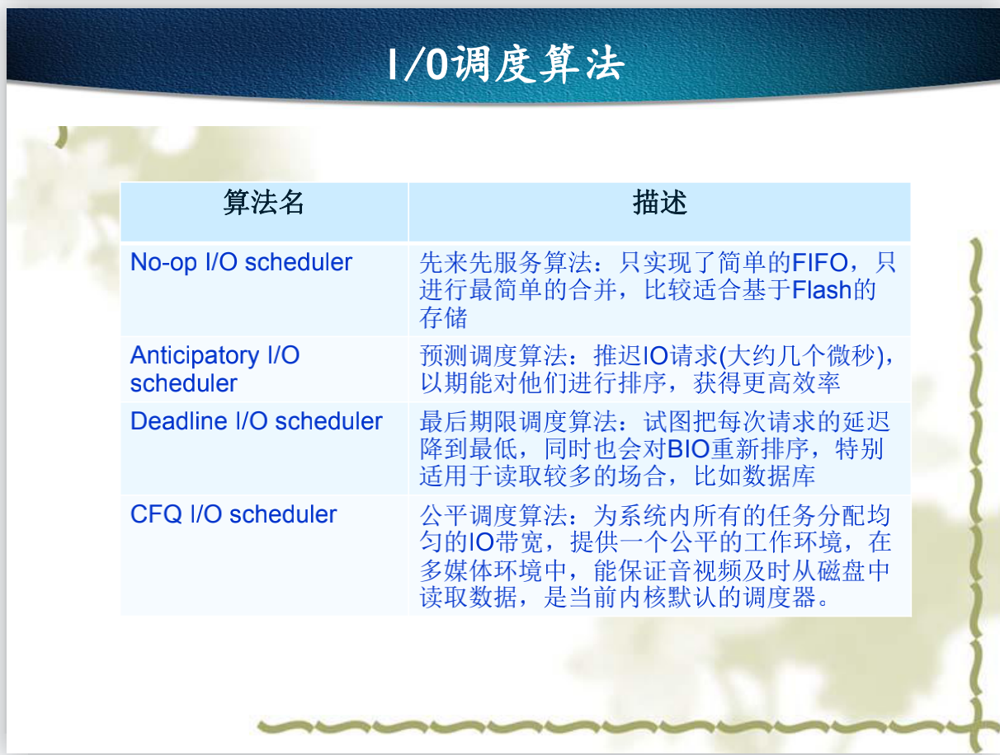