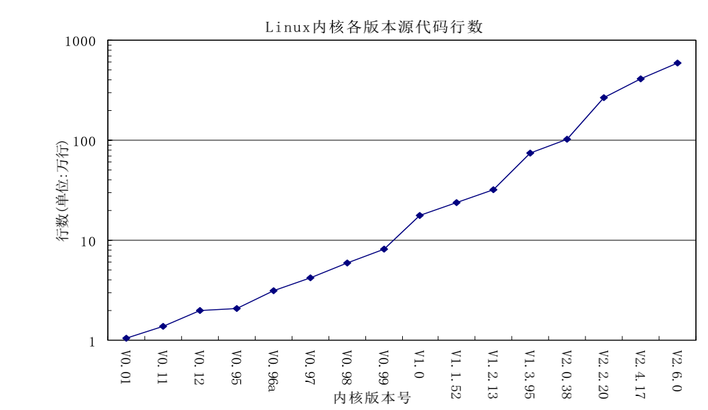
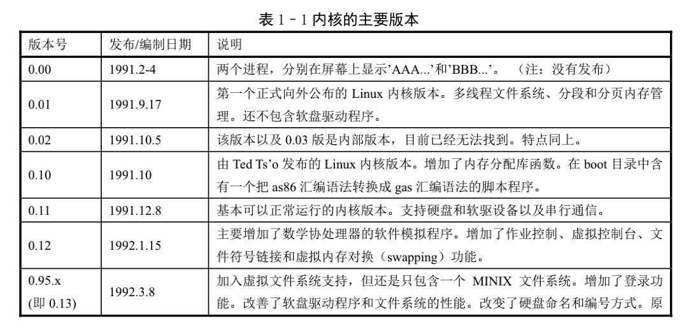
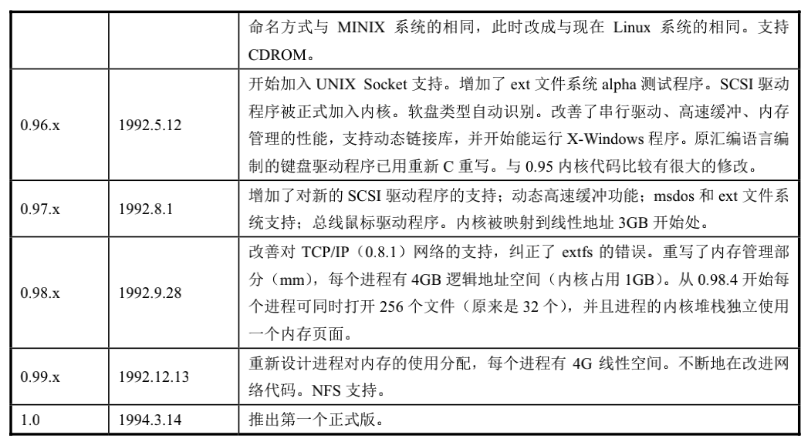
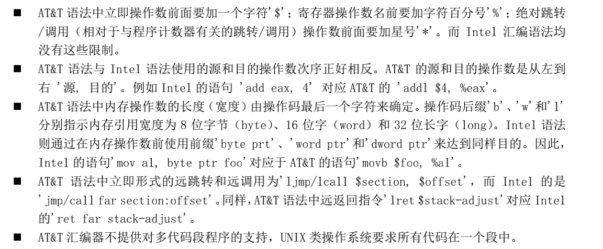

    
     
    
万家灯火

> 此文为学习《Linux内核完全注释》所做的笔记

<!-- more -->

### 第一章 概述

#### 一、如何选择阅读内核代码版本

- 2.6.0版内核代码行数约592行，极其庞大
- 0.11版内核不超过2万行代码量，麻雀虽小，五张俱全

#### 二、Linux的诞生和发展

##### 1.五个重要的支柱
- Unix操作系统:1969年诞生在Bell实验室
- MINIX操作系统
- GNU计划：旨在开发一个类似于UNIX并且自有免费的完全操作系统
- POSIX标准（该标准是基于Unix实践和标准，描述了操作系统的调用服务接口，是Linux前进的灯塔）和Internet网络

##### 2.Linux的版本变迁

### 第二章 微型计算机组成结构

#### 一、I/O端口和寻址

- 端口地址的设置方法一般有两种：统一编址和独立编址
- 统一编址：原理是把I/O控制器中的端口地址归入存储器寻址空间范围内
- 独立编址：采用一个独立的I/O地址空间对沈北中的寄存器进行寻址和访问

#### 二、接口访问控制

- 程序循环查询方式：指通过CPU在程序循环查询指定设备控制器中的状态来判断是否可以与设备进行数据交换
- 中断处理方式：I/O设备通过中断向CPU提出请求时，CPU才会暂时中断当前执行的程序转而执行相应的I/O中断处理服务过程。Linux中大多数设备I/O控制都采用中断处理方式
- DMA传输方式：用于I/O设备与系统内存之间进行批量数据传送，整个操作过程需要专门的DMA控制器进行而无需CPU插手

### 第三章 内核编程语言和环境

#### 一、阅读boot.s

- .globl是汇编指示符，在编译时不会产生任何代码
- .text——正文段、.data——用于标识数据段的开始位置、.bss段——用于标识一个未初始化数据段的开始
- 立即数前一定要加“#”，否则将作为内存地址使用

#### 二、AT&T语法和Intel汇编语法的区别

#### 三、内联函数
- 内联函数让gcc把函数的代码集成到调用该函数的代码中去
- 可以去掉函数调用时进入、退出的时间开销