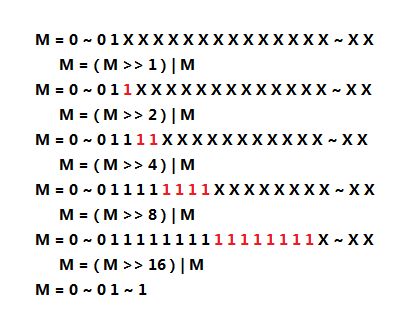

<center>
    
    <br>
    <div style="color:orange;
    display: inline-block;
    color: #999;
    padding: 2px;">朦胧脸庞</div>
</center>

> 此文为阅读cJson做的笔记，学习代码的风格与设计

<!-- more -->

#### 一、cJson的数据结构

cJSON的数据结构
```
/* The cJSON structure: */
typedef struct cJSON {
	struct cJSON *next,*prev;	/* next/prev allow you to walk array/object chains. Alternatively, use GetArraySize/GetArrayItem/GetObjectItem */
	struct cJSON *child;		/* An array or object item will have a child pointer pointing to a chain of the items in the array/object. */

	int type;					/* The type of the item, as above. */

	char *valuestring;			/* The item's string, if type==cJSON_String */
	int valueint;				/* The item's number, if type==cJSON_Number */
	double valuedouble;			/* The item's number, if type==cJSON_Number */

	char *string;				/* The item's name string, if this item is the child of, or is in the list of subitems of an object. */
} cJSON;
```

其中，typey有7种类型
```
/* cJSON Types: */
#define cJSON_False 0
#define cJSON_True 1
#define cJSON_NULL 2
#define cJSON_Number 3
#define cJSON_String 4
#define cJSON_Array 5
#define cJSON_Object 6
```

#### 二、cJson的使用

##### 构造json
 要构建的json：
```
"semantic": {
        "slots":    {
            "name": "张三"
        }
    },
    "rc":   0,
    "operation":    "CALL",
    "service":  "telephone",
    "text": "打电话给张三"
}
```

```
#include <stdio.h>
#include "cJSON.h"
 
int main()
{
    cJSON * root =  cJSON_CreateObject();
    cJSON * item =  cJSON_CreateObject();
    cJSON * next =  cJSON_CreateObject();
 
    cJSON_AddItemToObject(root, "rc", cJSON_CreateNumber(0));//根节点下添加
    cJSON_AddItemToObject(root, "operation", cJSON_CreateString("CALL"));
    cJSON_AddItemToObject(root, "service", cJSON_CreateString("telephone"));
    cJSON_AddItemToObject(root, "text", cJSON_CreateString("打电话给张三"));
    cJSON_AddItemToObject(root, "semantic", item);//root节点下添加semantic节点
    cJSON_AddItemToObject(item, "slots", next);//semantic节点下添加item节点
    cJSON_AddItemToObject(next, "name", cJSON_CreateString("张三"));//添加name节点
 
    printf("%s\n", cJSON_Print(root));
 
    return 0;
}
```

##### 解析的json
```
{
    "semantic": {
        "slots":    {
            "name": "张三"
        }
    },
    "rc":   0,
    "operation":    "CALL",
    "service":  "telephone",
    "text": "打电话给张三"
}
```
```
#include <stdio.h>
#include <stdlib.h>
#include "cJSON.h"
 
void printJson(cJSON * root)//以递归的方式打印json的最内层键值对
{
    for(int i=0; i<cJSON_GetArraySize(root); i++)   //遍历最外层json键值对
    {
        cJSON * item = cJSON_GetArrayItem(root, i);        
        if(cJSON_Object == item->type)      //如果对应键的值仍为cJSON_Object就递归调用printJson
            printJson(item);
        else                                //值不为json对象就直接打印出键和值
        {
            printf("%s->", item->string);
            printf("%s\n", cJSON_Print(item));
        }
    }
}
 
int main()
{
    char * jsonStr = "{\"semantic\":{\"slots\":{\"name\":\"张三\"}}, \"rc\":0, \"operation\":\"CALL\", \"service\":\"telephone\", \"text\":\"打电话给张三\"}";
    cJSON * root = NULL;
    cJSON * item = NULL;//cjson对象
 
    root = cJSON_Parse(jsonStr);     
    if (!root) 
    {
        printf("Error before: [%s]\n",cJSON_GetErrorPtr());
    }
    else
    {
        printf("%s\n", "有格式的方式打印Json:");           
        printf("%s\n\n", cJSON_Print(root));
        printf("%s\n", "无格式方式打印json：");
        printf("%s\n\n", cJSON_PrintUnformatted(root));
 
        printf("%s\n", "一步一步的获取name 键值对:");
        printf("%s\n", "获取semantic下的cjson对象:");
        item = cJSON_GetObjectItem(root, "semantic");//
        printf("%s\n", cJSON_Print(item));
        printf("%s\n", "获取slots下的cjson对象");
        item = cJSON_GetObjectItem(item, "slots");
        printf("%s\n", cJSON_Print(item));
        printf("%s\n", "获取name下的cjson对象");
        item = cJSON_GetObjectItem(item, "name");
        printf("%s\n", cJSON_Print(item));
 
        printf("%s:", item->string);   //看一下cjson对象的结构体中这两个成员的意思
        printf("%s\n", item->valuestring);
                        
 
        printf("\n%s\n", "打印json所有最内层键值对:");
        printJson(root);
    }
    return 0;    
}
```


#### 三、算法提炼

##### pow2gt函数
```
static int pow2gt (int x)	{
   	  --x;	
      x|=x>>1;	
      x|=x>>2;	
      x|=x>>4;	
      x|=x>>8;	
      x|=x>>16;	
      return x+1;	
      }
```


考虑到int是32位，那么对于任何一个M，当它执行完上图中的5步操作后，M的最左边为1的那位向右全部被赋值为1，因此，在最后return x+1 时，就会返回>=M最小的2的N次方数。而最开始的–x，是因为当x本身就是一个2的N次方数时，返回值为x本身，所以需要减1来保证正确性。

#### 四、使用的函数学习
##### 1.int tolower(int c)
C 库函数 int tolower(int c) 把给定的字母转换为小写字母。
```
#include <stdio.h>
#include <ctype.h>
 
int main()
{
   int i = 0;
   char c;
   char str[] = "RUNOOB";
 
   while( str[i] ) 
   {
      putchar(tolower(str[i]));
      i++;
   }
 
   return(0);
}
```
输出
```
runoob
```

##### 2.memcpy(void *str1, const void *str2, size_t n)
> C 库函数 void *memcpy(void *str1, const void *str2, size_t n) 从存储区 str2 复制 n 个字节到存储区 str1。

- str1 -- 指向用于存储复制内容的目标数组，类型强制转换为 void* 指针。
- str2 -- 指向要复制的数据源，类型强制转换为 void* 指针。
- n -- 要被复制的字节数。

##### 3.memset()
> C 库函数 void *memset(void *str, int c, size_t n) 复制字符 c（一个无符号字符）到参数 str 所指向的字符串的前 n 个字符。
```
void *memset(void *str, int c, size_t n)
```
- str -- 指向要填充的内存块。
- c -- 要被设置的值。该值以 int 形式传递，但是函数在填充内存块时是使用该值的无符号字符形式。
- n -- 要被设置为该值的字节数。

#### 风格学习
- 函数命名要规范，尽量表达清楚函数的用途
- 相近函数功能在头文件里放到一块
- 每个函数上面要写清楚注释，说明函数的功能，每个函数的参数的意义，以及某些参数限定的传参
- 对输入参数进行过滤，尤其判断一些异常情况

#### 五、其他细节问题

##### extern "C"
在cJson的头文件中存在
```
#ifdef __cplusplus
extern "C"
```
C++之父在设计C++之时，考虑到当时已经存在了大量的C代码，为了支持原来的C代码和已经写好C库，需要在C++中尽可能的支持C，而extern "C"就是其中的一个策略。

因此，为了在C++代码中调用用C写成的库文件，就需要用extern "C"来告诉编译器:这是一个用C写成的库文件，请用C的方式来链接它们。

##### extern声明函数
如果函数 的声明中带有关键字extern，仅仅是暗示这个函数 可能在别的源文件里定义，没有其它作用。即下述两个函数 声明没有明显的区别：extern int f(); 和int f();

当然，这样的用处还是有的，就是在程序中取代include “*.h”来声明函数 ，在一些复杂的项目中，比较习惯在所有的函数 声明前添加extern修饰。

##### size_t和int区别
 size_t是一些C/C++标准在stddef.h中定义的。这个类型足以用来表示对象的大小。size_t的真实类型与操作系统有关。

 在32位架构中被普遍定义为：
```
typedef   unsigned int size_t;
```
而在64位架构中被定义为：
```
typedef  unsigned long size_t;
```
为什么有时候不用int，而是用size_type或者size_t

> 与int固定四个字节不同有所不同,size_t的取值range是目标平台下最大可能的数组尺寸,一些平台下size_t的范围小于int的正数范围,又或者大于unsigned int. 使用Int既有可能浪费，又有可能范围不够大。
