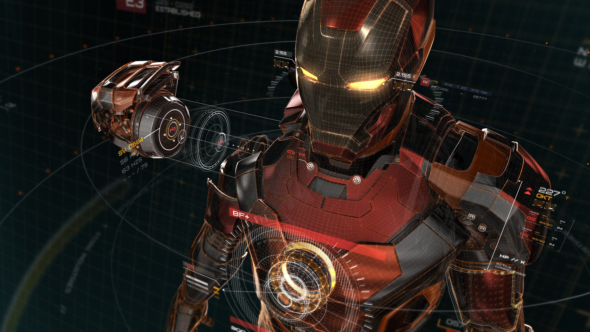

<center>
    
    <br>
    <div style="color:orange;
    display: inline-block;
    color: #999;
    padding: 2px;">钢铁侠</div>
</center>

> 华为的性格测试还是比较坑的，建议面试者在做之前看看攻略，自己就挂过一次，需要注意前后一致，还有不要想着领导别人，螺丝钉性格比较合适

1 最合适的性格
```
我信守自己做出的承诺

我觉得人们信守承诺相当重要

我坚持按时完成任务

我做事广泛听取别人的意见

做事前我会征询大家的意见

我愿意花时间去帮助别人

我做事不喜欢半途而废

我必须了解底层原理才能更有效的学习

我倾向于根据客观事实做决定

我必须找到解决问题的办法

我需要了解论点背后的逻辑

我喜欢创新

做事时我喜欢有新方法、新点子

我能想出很多主意

我喜欢提出很多主意

我喜欢提出独到的见解

````

2 适中的性格
```
我善于和别人建立融洽关系

我喜欢有压力的环境下工作

我喜欢忙碌的生活

我需要有明确的远景计划

我喜欢思考未来

我给自己设定了长远目标

我经常展望未来

我对未来比较乐观

我相信未来的事情会是好的

我做事很有远见

做事的时候我需要有章可循

我做事井井有条

我非常注重细节

我善于同时处理多项任务

我循规蹈矩地去做事情

我喜欢对数据进行统计与分析

我喜欢讨论抽象性的问题

我善于处理数字资料

我不容易被别人激怒

不信任他人

我在陌生朋友交流时会轻松自在

我大部分时间是快乐的

我有强烈的好奇心

我喜欢有竞争的工作

我是一个竞争心很强的人

```

3 不适合的性格
```
我掌控着自己的未来

我在重大事情发生前会紧张

我想有人陪在我身边

我坚持自己的做事方式

我善于结交朋友

我喜欢结识陌生人

我善于谈判

我善于推销

我是个很健谈的人

我关注别人的做事目的与做事动机

我善于理解人们背后的的动机

我善于体会他人的感受

我要超越别人

我有较大的野心

我想成为团队中的领导

我更愿意领导别人

我喜欢挑战别人的想法

我享受独自工作

```