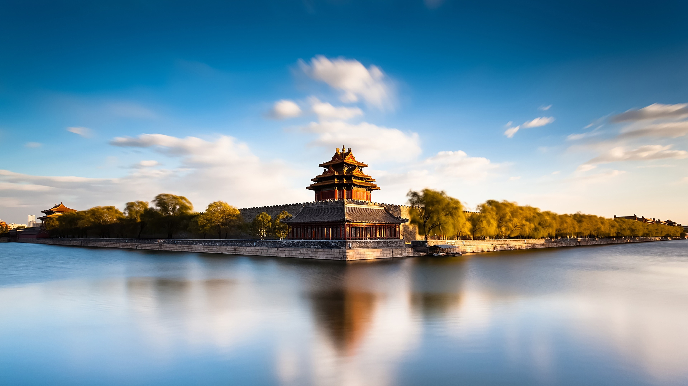
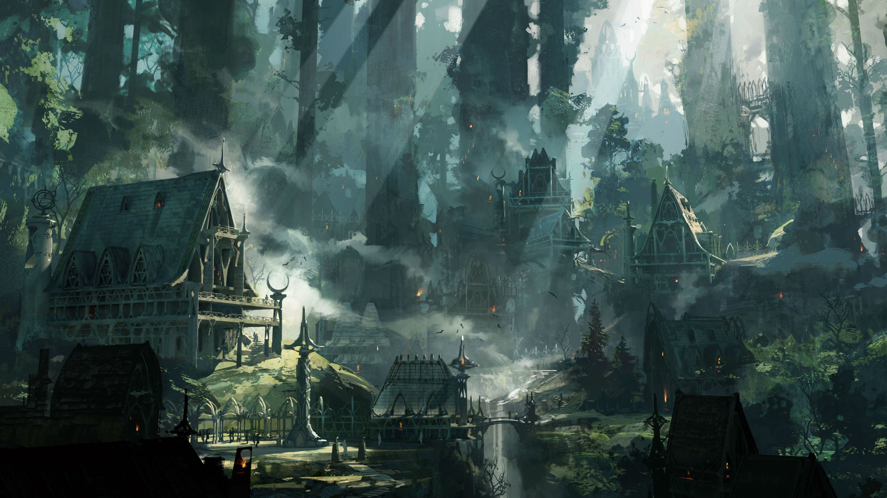

    
     
    
山川岁月

文 |  易子闳
 

&emsp;&emsp;弃我去者，昨日之日不可留；乱我心者，今日之日多烦忧。坐上了南下的动车，在车上思绪万千。因为疫情，我们只有短短的三日回学校毕业，没有想象中的热闹与繁华，只有满眼的落寞与冷清。回学校办了手续，独自骑上电动车，满富仪式感地游览校园，不知怎的，思绪如流水般流淌，泪水和雨水在眼眸交织，慢慢回忆过往，慢慢与喻家山告别。
<!-- more -->
&emsp;&emsp;子在川上曰：逝者如斯乎，不舍昼夜。多少人的青春留在了喻家山下，多少的回忆成了过往，有多少想说的话，多少想表达的情感，都化成了朋友圈一张张或哭或笑的照片，都揉进了一首首或慷慨激昂或低沉婉转的歌曲里。历史，对于旁观者只是一段故事，而对于亲历者却是数不尽的喜悦与感伤。分享之人，必有想说之事，可未必所有人都会停留听你诉说，对过客来说，你说的是故事，可对你来说却是四年的轰轰烈烈的时光呀。光阴何尝不是一条河流，我们伫立在河中央，河水从身旁流过，带着丝丝无情与坚定，无论我们如何努力，它还是义无反顾地流走了。

    
     
    
时间倒影

&emsp;&emsp;多少个日夜，每当我在聚精会神地阅读学习的时候，灯突然灭了，这是启明的规定：在启明楼里的学生必须十二点离开。我多么恨那只拉电闸的手，它恶狠狠地又从我的生命中割走了一天。走出启明，一个人在回去的路上，望着朦胧月色，我泪眼汪汪，感叹时光流逝。弃我去的不是日历上一个个日子，而是我生命中的岁月；甚至不仅仅是我的岁月，而是我自己。我们的生命或许是由一个个自己组成，他会因为韵苑可口的拉面而开心，他会因为做错事而懊恼不已，他会为了微机原理课设而彻夜不眠。他仿佛是个孤儿，被遗留在过去的岁月里，他举目无亲，孑然一身。
我大声向他呼喊，多么想把他带回，可是我无法与岁月的洪流抗衡，他慢慢成了过往和回忆。或许正是因为成为了回忆，我开始怀恋考试月和胡杨坐绿皮车去主图啃一本本厚厚的专业书，开始觉得在深信服写C++只有成长没有痛苦，开始以为除了淇营就数我和矢量唱歌最好听。岁月的急流带走了自己，也扭曲了记忆，让我们记住了快乐，忘却了痛苦，满满的苦尽甘来的滋味。

    
     
    
星辰大海

&emsp;&emsp;临走之前，和新睿聊大学四年到深夜，新睿觉得要是大学四年可以重新来过，那绝对不会这么过。对啊，我还没打卡学校34座食堂，还没把东湖的各个路线摸熟，还没在启明楼下螺蛳粉店最后被推倒之前去吃上最后一碗螺蛳粉，还没去蹭过节节爆满的深度中国，还没在学校里见到自己喜欢的作家方方，还没......还在喻家山时觉得她平白无奇，要走时，她的点点滴滴，化成颗颗璀璨夺目的珍珠，散落在时间的长河，熠熠生辉。在日后的某年某月，和挚友闲聊时，才会把它们从长河中拾起，串成打上了喻家山和Dian烙印的珍珠项链。

&emsp;&emsp;因为失去青春，我们才懂得长大；因为失去岁月，我们才知道缅怀时间。每个人的大学四年，都有自己专属的特点，我们四处找寻团队，交往朋友，就是想把最珍贵的岁月揉进喻家山的历史长河，磨砺颗颗珍珠。回首自己的四年，时光被熔铸在《第一行代码》和《深入理解Java虚拟机》中，被回响于网安组服务器声声轰鸣声中，被填充在海底捞过后的满天星里，被藏匿在游客如织的樱园里，被浸润在团队导师声声教诲之中。人们把失去的称为过去，尚未得到的称为未来，停在手里的称为现在。可是时间何时停留过，现在转瞬即逝，成为过去，我们又拥有什么？

    
     
    
深林小屋

&emsp;&emsp;许多年后，当我们回到喻家山下，看着那一张张陌生稚嫩的面孔，我们难免会怅然若失，因为许多年前，我们才是喻家山的主人，我们才是那篮球场上飞驰的身影，我们才是东九楼里冥思苦想的少年。嫉妒之情油然而生，他们成了喻家山母亲的最小的孩子，他们可以在校园里大喊大笑，他们成了老师心头最疼爱关心的学生。当年喻园吃过的油条最香甜，当年追过的姑娘最动人，当年我们见证了喻家山下那段悲壮的抗疫史，当年我们成了有史以来最特殊的毕业生。可是，多年后，我们努力推掉手头的工作，和当年的同学相聚，我们寻访恩师，故地重游，企图找回当年的爱恨情仇，酸甜苦辣，然而这一切都是徒劳。我们终于怅然发现，时光带走的不只是我们最美好的青春，而是由当年善良的人，高大的梧桐，壮丽的大楼，巍峨的喻家山，蔚蓝的天空一起组成的世界，其中还包含着我们的爱和忧愁，感觉和性情，我们当年整个的心灵世界呀！

&emsp;&emsp;莫问前路无知己，天下谁人不识君。多年前，喻家山下走出了微信之父张小龙，中国网球第一人李娜，中国外科之父裘法祖。喻家山人在各行各业崭露头角，独领风骚。我们处在喻家山的不同的时代，但是却得到了喻家山同样的哺育与关爱，今天的他们，必定会是明天的我们。